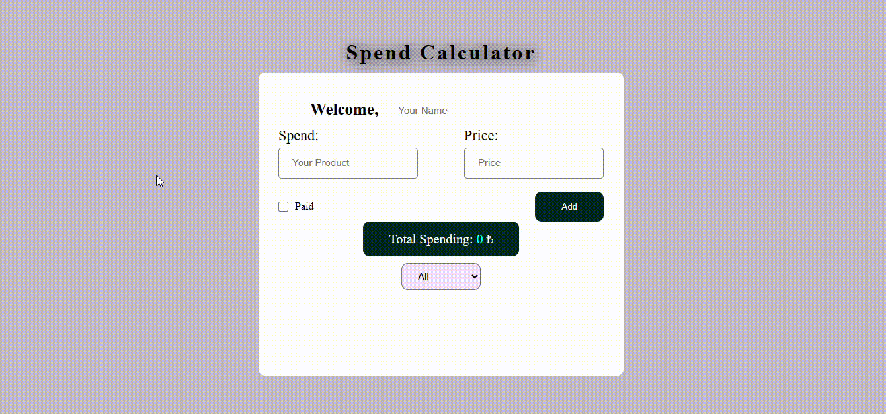

# Spend Calculator

Spend Calculator is a simple web application designed to help users keep track of their expenses. Whether you're managing personal finances or splitting costs with friends, this tool provides a straightforward way to log and monitor your expenditures.

## Features

- **User-Friendly Interface:** The application offers a clean and intuitive interface, making it easy for users to input and manage their expenses.

- **Persistent User Name:** Your name is stored locally using browser localStorage, allowing for a personalized experience every time you visit the site.

- **Expense Entry:** Users can add new expenses by providing details such as the expense name, amount spent, and payment status.

- **Payment Status:** Each expense can be marked as paid or unpaid, providing a quick visual indication of your financial status.

- **Total Expense Tracking:** The application calculates and displays the total amount of all expenses, providing a quick overview of your spending.

- **Filtering Options:** Users can filter expenses based on payment status (all, paid, not paid), helping to focus on specific sets of transactions.

## Technologies Used

- **HTML5:** The markup language for structuring the web page.
- **CSS3:** Stylesheets for styling and layout.
- **JavaScript (ES6+):** Programming language for dynamic functionality.

## Getting Started

To get started with the Expense Tracker, follow these simple steps:

1. Open the application in your web browser.

2. Enter your name in the designated input field. Your name will be saved for future visits.

3. Add expenses by providing the necessary details, including the expense name, amount spent, and payment status.

4. Monitor your total expenses and use the filtering options to view specific subsets of your transactions.

## How to Run Locally

To run the project locally, follow these steps:

1. Clone the repository to your local machine.

    ```bash
    git clone https://github.com/Abou1205/expense-tracker.git
    ```

2. Open the `index.html` file in your preferred web browser.

3. Start tracking your expenses!


Feel free to customize the README to better fit the specifics of your project!

## Demo


